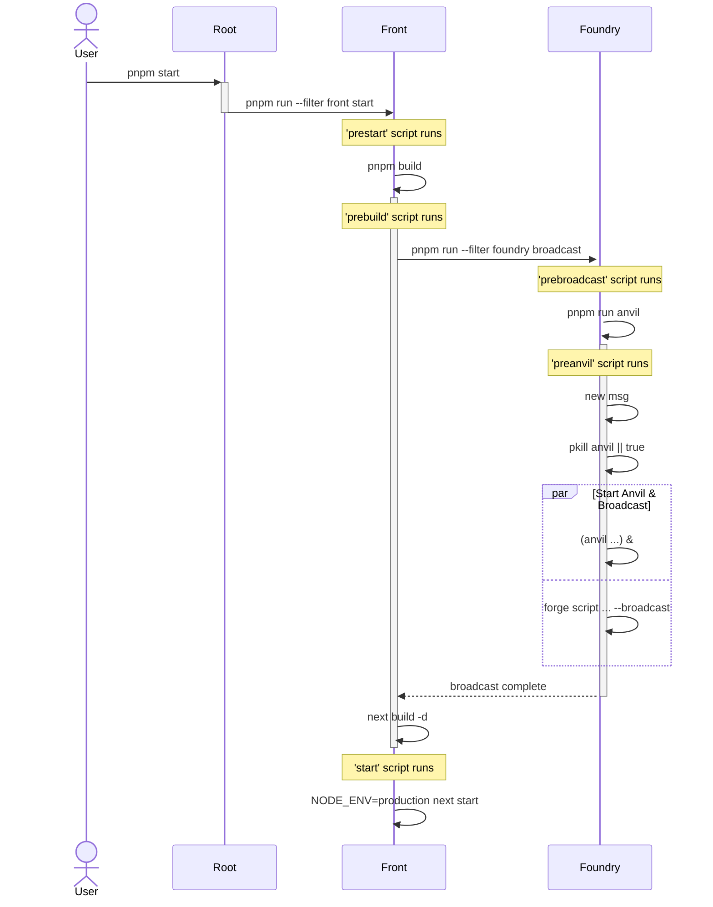

# case5-onchain-sepolia

[계정 0x4262Aa56B97f776C075883b6077719ca3B997023](https://sepolia.etherscan.io/address/0x4262aa56b97f776c075883b6077719ca3b997023)으로
[Sepolia에 배포된 컨트랙트](https://sepolia.etherscan.io/address/0xc2baed95c726af81d285411979d7713e6abdcd4f#code)에 등록된 이름을 참조하여
`Hello, ${name}`을 출력하는 간단한 DApp

1. 프로젝트 구조 변경: Monorepo
    - 하위 workspace로 분리 - `foundry`, `front`
    - 루트 `package.json`에서 실행 가능한 명령어 정리
2. 스마트 컨트랙트 및 배포 변경: `foundry/.env` 파일 기반 Sepolia 테스트넷 배포
3. Route `api/config` - 시스템 설정 확인
    - [`api/config/chain`](https://oomia.github.io/hands-on-dapp/api/config/chain)
    - [`api/config/name`](https://oomia.github.io/hands-on-dapp/api/config/name)
    - [`api/config/address`](https://oomia.github.io/hands-on-dapp/api/config/address)
4. 실행 환경 및 의존성 업데이트
    - node>=24, pnpm@10, next@15.3 (* 단, 이에 파생되는 breaking changes는 없습니다) 
    - [jest](https://jestjs.io/)로 단위 테스트
    - [playwright](https://playwright.dev/)로 e2e 테스트
    - [viem](https://viem.sh/)로 컨트랙트 환경 설정 
5. 공용 및 개별 프로젝트 명령어는 `package.json` 참조

### Sequence Diagram

# [Next.js 15](https://nextjs.org/blog/next-15)

- [**`@next/codemod` CLI:**](#smooth-upgrades-with-nextcodemod-cli) Easily upgrade to the latest Next.js and React versions.
- [**Async Request APIs (Breaking):**](#async-request-apis-breaking-change) Incremental step towards a simplified rendering and caching model.
- [**Caching Semantics (Breaking):**](#caching-semantics) `fetch` requests, `GET` Route Handlers, and client navigations are no longer cached by default.
- [**React 19 Support:**](#react-19) Support for React 19, React Compiler (Experimental), and hydration error improvements.
- [**Turbopack Dev (Stable):**](#turbopack-dev) Performance and stability improvements.
- [**Static Indicator:**](#static-route-indicator) New visual indicator shows static routes during development.
- [**`unstable_after` API (Experimental):**](#executing-code-after-a-response-with-unstable_after-experimental) Execute code after a response finishes streaming.
- [**`instrumentation.js` API (Stable):**](#instrumentationjs-stable) New API for server lifecycle observability.
- [**Enhanced Forms (`next/form`):**](#form-component) Enhance HTML forms with client-side navigation.
- [**`next.config`:**](#support-for-nextconfigts) TypeScript support for `next.config.ts`.
- [**Self-hosting Improvements:**](#improvements-for-self-hosting) More control over `Cache-Control` headers.
- [**Server Actions Security:**](#enhanced-security-for-server-actions) Unguessable endpoints and removal of unused actions.
- [**Bundling External Packages (Stable):**](#optimizing-bundling-of-external-packages-stable) New config options for App and Pages Router.
- [**ESLint 9 Support:**](#eslint-9-support) Added support for ESLint 9.
- [**Development and Build Performance:**](#development-and-build-improvements) Improved build times and Faster Fast Refresh.

# Basic Instructions

- [Next.js](https://nextjs.org)
- [`create-next-app`](https://nextjs.org/docs/app/api-reference/cli/create-next-app)
- [Geist](https://vercel.com/font)
- [Next.js Documentation](https://nextjs.org/docs)
- [Learn Next.js](https://nextjs.org/learn)
- [Next.js GitHub repository](https://github.com/vercel/next.js)
- [Vercel Platform](https://vercel.com/new?utm_medium=default-template&filter=next.js&utm_source=create-next-app&utm_campaign=create-next-app-readme)
- [Next.js deployment documentation](https://nextjs.org/docs/app/building-your-application/deploying)
