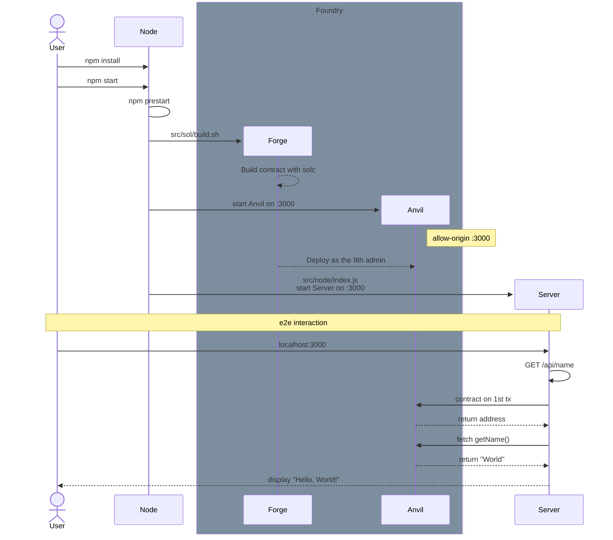

# case5-onchain-sepolia

`Hello, World!`를 출력하는 간단한 DApp

GET `/api/name` 요청으로 등록된 배포자의 이름 참조

스마트 컨트랙트는 Sepolia TestNet에 개인 계정으로 배포

- 하위 workspace로 Foundry 내장
- [node:test](https://nodejs.org/api/test.html)와 [tsx](https://tsx.is/)로 단위 테스트
- [playwright](https://playwright.dev/)로 e2e 테스트
- [ethers.js](https://docs.ethers.org/)로 컨트랙트 호출 결과 변환

```bash
npm install

npm start

npm test

npm e2e
```

### Sequence Diagram



# [Next.js 15](https://nextjs.org/blog/next-15)

- [**`@next/codemod` CLI:**](#smooth-upgrades-with-nextcodemod-cli) Easily upgrade to the latest Next.js and React versions.
- [**Async Request APIs (Breaking):**](#async-request-apis-breaking-change) Incremental step towards a simplified rendering and caching model.
- [**Caching Semantics (Breaking):**](#caching-semantics) `fetch` requests, `GET` Route Handlers, and client navigations are no longer cached by default.
- [**React 19 Support:**](#react-19) Support for React 19, React Compiler (Experimental), and hydration error improvements.
- [**Turbopack Dev (Stable):**](#turbopack-dev) Performance and stability improvements.
- [**Static Indicator:**](#static-route-indicator) New visual indicator shows static routes during development.
- [**`unstable_after` API (Experimental):**](#executing-code-after-a-response-with-unstable_after-experimental) Execute code after a response finishes streaming.
- [**`instrumentation.js` API (Stable):**](#instrumentationjs-stable) New API for server lifecycle observability.
- [**Enhanced Forms (`next/form`):**](#form-component) Enhance HTML forms with client-side navigation.
- [**`next.config`:**](#support-for-nextconfigts) TypeScript support for `next.config.ts`.
- [**Self-hosting Improvements:**](#improvements-for-self-hosting) More control over `Cache-Control` headers.
- [**Server Actions Security:**](#enhanced-security-for-server-actions) Unguessable endpoints and removal of unused actions.
- [**Bundling External Packages (Stable):**](#optimizing-bundling-of-external-packages-stable) New config options for App and Pages Router.
- [**ESLint 9 Support:**](#eslint-9-support) Added support for ESLint 9.
- [**Development and Build Performance:**](#development-and-build-improvements) Improved build times and Faster Fast Refresh.

# Basic Instructions

- [Next.js](https://nextjs.org)
- [`create-next-app`](https://nextjs.org/docs/app/api-reference/cli/create-next-app)
- [Geist](https://vercel.com/font)
- [Next.js Documentation](https://nextjs.org/docs)
- [Learn Next.js](https://nextjs.org/learn)
- [Next.js GitHub repository](https://github.com/vercel/next.js)
- [Vercel Platform](https://vercel.com/new?utm_medium=default-template&filter=next.js&utm_source=create-next-app&utm_campaign=create-next-app-readme)
- [Next.js deployment documentation](https://nextjs.org/docs/app/building-your-application/deploying)
