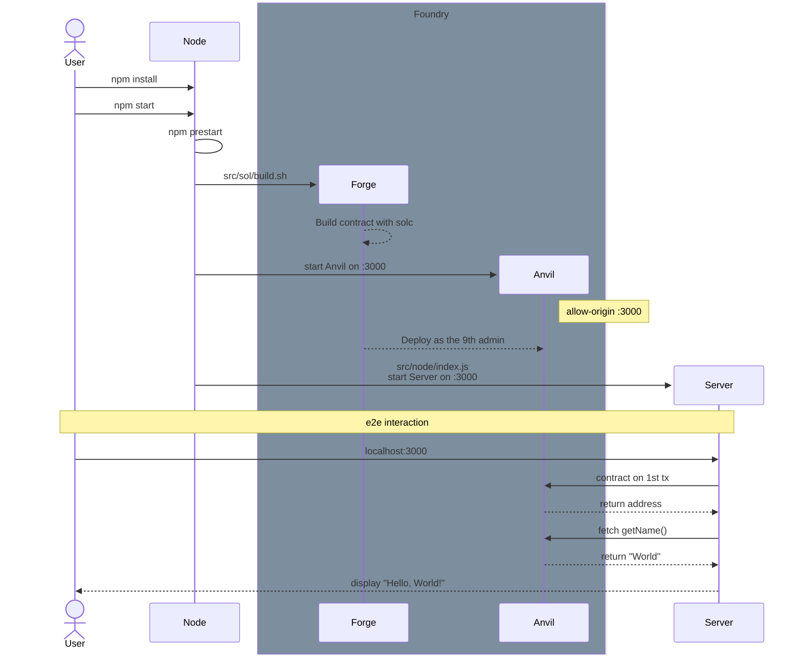

# case2-setup-foundry

의존성을 최소화한 간단한 DApp

컨트랙트 관련 작업을 Foundry 프레임워크를 활용하여 하위 workspace로 분리

```bash
npm install

npm start
```

### Sequence Diagram


```mermaid
sequenceDiagram

    actor U as User
    participant N as Node

    U ->> N: npm install
    U ->> N: npm start
    N -> N: npm prestart

    create participant F as Forge
    N ->> F: src/sol/build.sh
    F -->> F: Build contract with solc
    create participant A as Anvil
    N ->> A: start Anvil on :3000
    Note right of A: allow-origin :3000

    F -->> A: Deploy as the 9th admin

    box rgba(33,66,99,0.5) Foundry
    participant A
    participant F
    end

    create participant S as Server
    N ->> S: src/node/index.js<br>start Server on :3000

    Note over U,S: e2e interaction
    U ->> S: localhost:3000
    S ->> A: contract on 1st tx
    A -->> S: return address
    S ->> A: fetch getName()
    A -->> S: return "World"
    S -->> U: display "Hello, World!"
```
