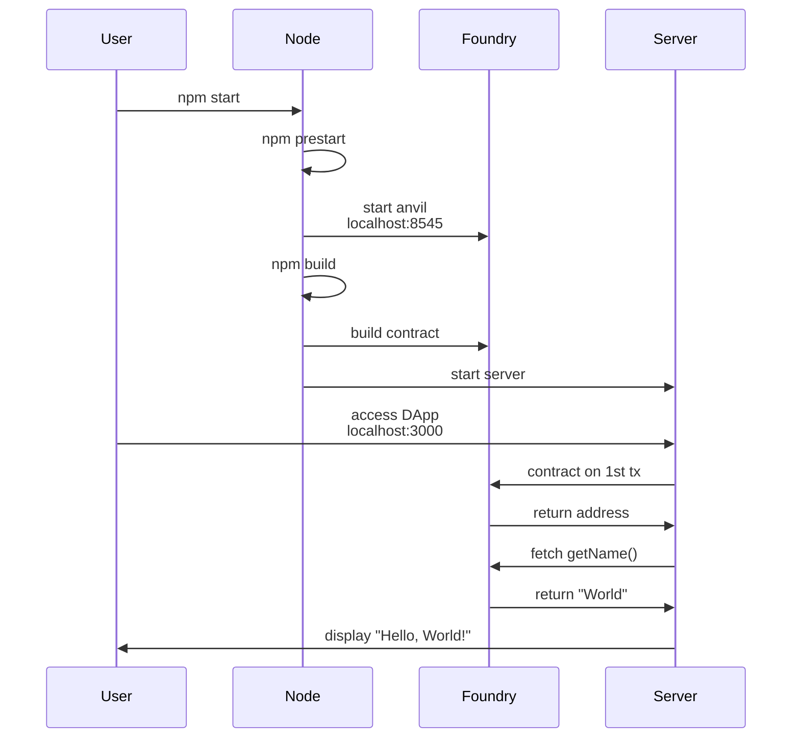

# case1-hello-world

의존성을 최소화한 간단한 DApp

```bash
npm install

npm start
```

### Sequence Diagram

```mermaid
sequenceDiagram
    participant User
    participant Node
    participant Foundry
    participant Server

    User->>Node: npm start
    Node->>Node: npm prestart
    Node->>Foundry: start anvil<br>localhost:8545
    Node->>Node: npm build
    Node->>Foundry: build contract
    Node->>Server: start server

    User->>Server: access DApp<br>localhost:3000
    Server->>Foundry: contract on 1st tx
    Foundry->>Server: return address
    Server->>Foundry: fetch getName()
    Foundry->>Server: return "World"
    Server->>User: display "Hello, World!"
```
