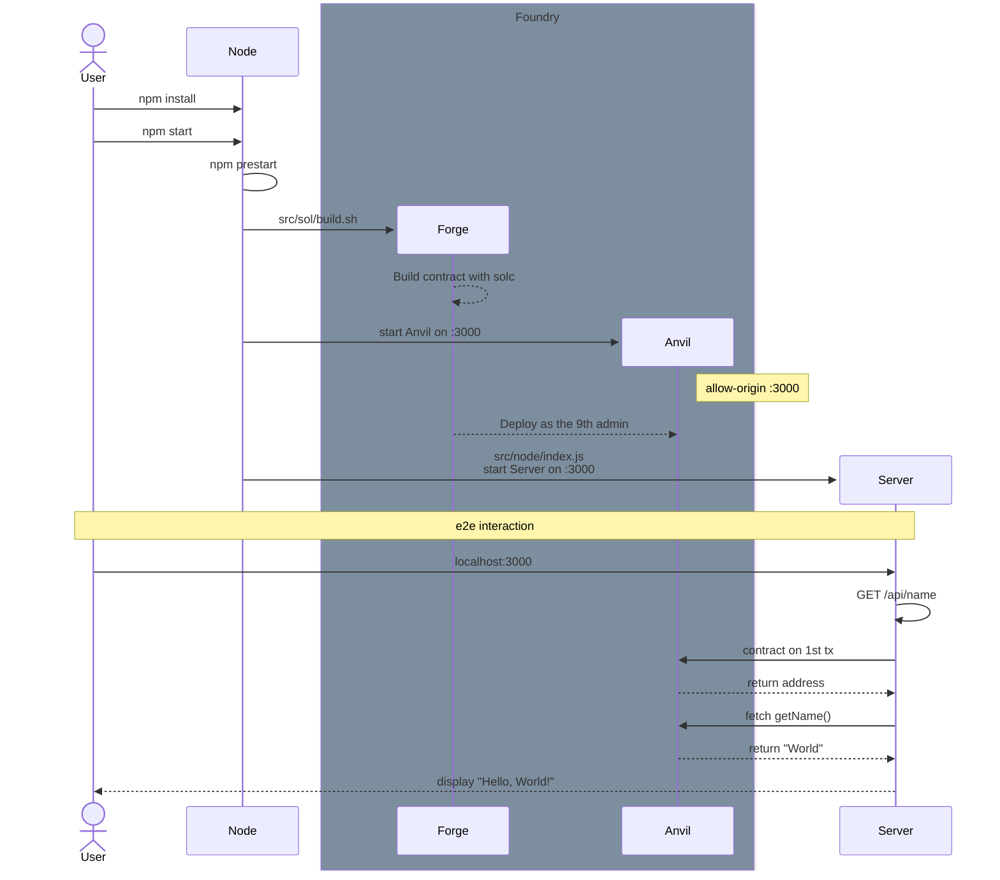

# case3-e2e-test

`Hello, World!`를 출력하는 간단한 DApp

GET `/api/name` 요청으로 등록된 배포자의 이름 참조

- 하위 workspace로 Foundry 내장
- [playwright](https://playwright.dev/)로 e2e 테스트
- [ethers.js](https://docs.ethers.org/)로 컨트랙트 호출 결과 변환

```bash
npm install

npm start

npm test
```

### Sequence Diagram


